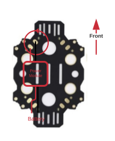
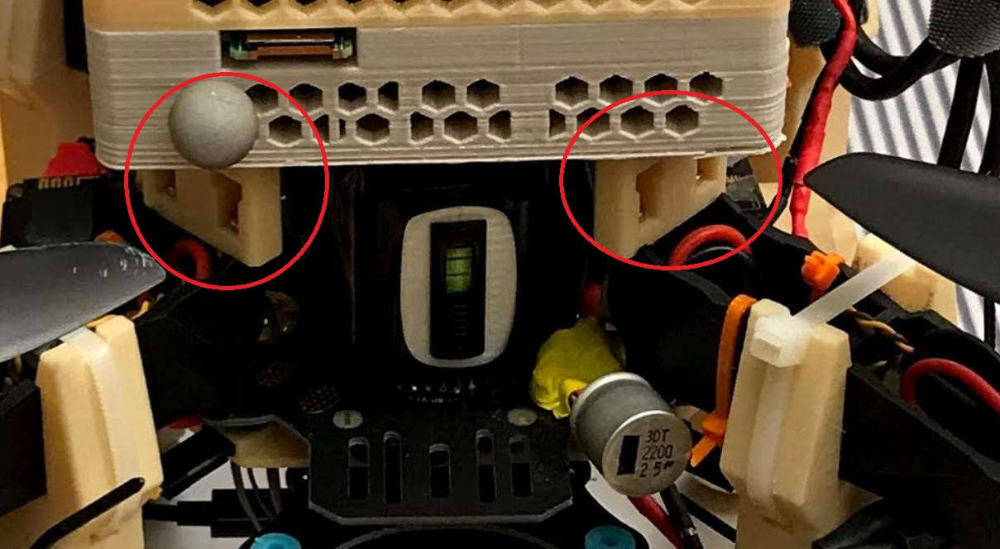

# Frame Assembly

The frame used in this design is a [Q380 Multirotor Frame](https://www.aliexpress.com/item/32416043953.html)
with a Power Distribution Board (PDB) integrated into
the frame body.

**NOTE:** It is recommended to follow some of the power supply
installation instructions prior to assembling the frame
as it will be easier to solder necessary components to
the integrated PDB before the frame is assembled.

## PDB Installation.

The Q380 Multirotor PDB embedded into the bottom plate requires the following steps before being assembled into the frame.

1. You need a [Power Module](https://ardupilot.org/copter/docs/common-3dr-power-module.html), this will be soldered into the PDB in the spot marked as follows:

<kbd>
  
</kbd>

Note that we also need to solder a filtering capacitor into the PDB at the same spot (red circle).
The XT60 battery connector on one end of the Power module is left to be able to exchange the type of connector (XT60 to XT60 or XT60 to XT90) that will be placed in the 3D printed holder, as well this was also intended to be connected to an inline voltage alarm ( to replace the alarm that connects directly to each cell). The result of how this looks after mounting is shown next.

<kbd>
  
</kbd>

## Standard Frame Assembly

Assembling the standard frame is fairly straightforward,
by following the instructions in the [Q380 Multirotor Frame Kit](https://www.aliexpress.com/item/32416043953.html).
Only the parts included in the frame kit are required.

This assembly is sufficient for smaller battery form
factors, i.e. 4000 mAh 4S LiPo batteries.
However, the optimal design includes a 8500 mAh LiPo
battery that requires 3D printed [Large Battery Adapters](https://drive.google.com/drive/folders/1uap2Yj39mSSUyjF8RAOGZAhPu2N2kLyg?usp=sharing)
to clear enough space for the large battery form factor.

## Large Battery Frame Assembly

### Required Parts

  * 1x [Q380 Multirotor Frame Kit](https://www.aliexpress.com/item/32416043953.html) (w/ accompanying screws)
  * 4x [Large Battery Adapter](https://drive.google.com/drive/folders/1uap2Yj39mSSUyjF8RAOGZAhPu2N2kLyg?usp=sharing)
  * 8x M2.5 x 12 phillips screws (slightly shorter OK)
  * 8x M3 x 10 torx scews
  * 8x M3 Nuts

<kbd>
  
</kbd>

### Procedure

#### 3D Printing

Assembling the landing gear first requires printing all necessary components, detailed in the table below:

| Component Name                | Quantity | Recommended Orientation |
| --------------                | -------- | ----------------------- |
| Large Battery Adapter         | 4        | Top side down           |

CAD files can be found at [Large Battery Adapter](https://drive.google.com/drive/folders/1uap2Yj39mSSUyjF8RAOGZAhPu2N2kLyg?usp=sharing).
The recommended orientations are selected primarily for
ease of removing the breakaway support material.
In this case, it is so the nut slot doesn't fill with support material.

For our implementation, the parts were printed with PLA material using
the standard print settings (with breakaway support under bridges) of
the Makerbot Replicator+ 3D printer. Printed component quality/durability
could possibly be improved by the use of ABS material or by modifying print settings.

Recommended setting changes for these parts include:

  * 60% infill
  * Hexagonal Fill Pattern

#### Assembly

  1. Connect the drone frame arms to the lower plate, per instructions in the kit.
     1. Have the side with the centered power terminals on the bottom.
        

        <kbd>
          
        </kbd>
        

  2. Attach the bottom of 3D printed adapters to top of Q380 arms with M2.5x12 screws.
     1. Have the screw openings in the printed components facing out.
     2. Stick small screwdriver through top hole to access bottom screw.
  3. Flip entire top (with arms already attached) upside down
  4. Slip M3 nuts into slots
     1. It will probably be easier to complete this and the next step together, one screw at a time.
  5. Attach Q380 top plate to adapters with M3 x 10 torx scews.
     1. Consider mounting the NUC mount bottom component to the Q380 top plate before
        attaching the top plate to the rest of the frame.
        It will make the [Assembly - NUC Bottom Mount](peripherals.md#bottom-mount) step easier.

<kbd>
  
</kbd>

--

**Weight added from larger battery adapters**

  * Total:		26 	g (all four)
  * Per arm:	6.5	g/set

  * Individual components:
    * Printed Adapter:	~3.5	g/st
    * M2.5 x 12:	~0.5	g/st
    * M3 x 10:	~0.5	g/st
    * M3 nut:		~0.25	g/st
