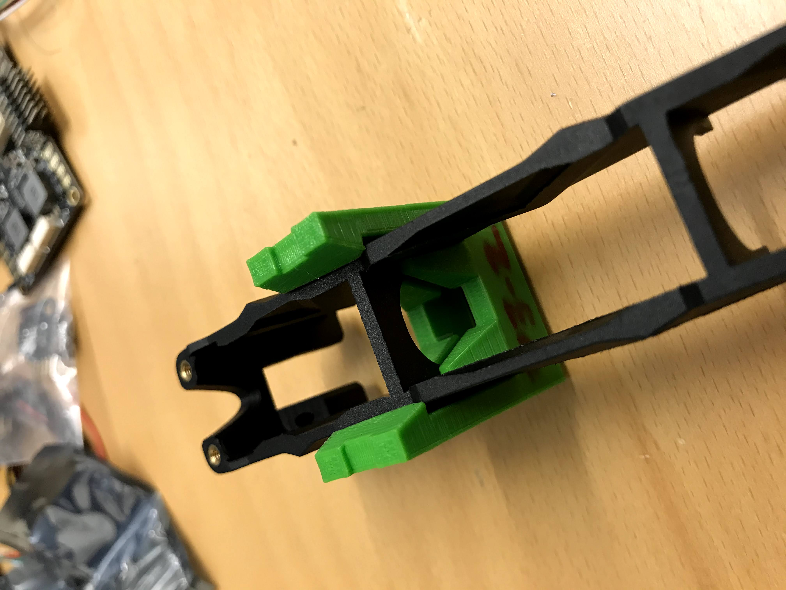

# Landing Gear Assembly

## Required Parts

  * 2x sets of 3D printed standard leg components
  * 2x sets of 3D printed D435i mount leg components
  * 12x [NdFeB magnets](https://www.magnordic.se/supermagneter-8x3-mm) of 8x3 mm (1.3 kg tensile force)
  * 4x Large zip ties (e.g. 200mm x 4.6mm)

## Procedure

### 3D Printing

Assembling the landing gear first requires printing all necessary components, detailed in the table below:

| Component Name                | Quantity | Recommended Orientation |
| --------------                | -------- | ----------------------- |
| Main Leg (No camera mount)    | 2        | Arm connection down     |
| Main Leg (With camera mount)  | 2        | Arm connection down     |
| Lower Leg                     | 4        | Magnetic slots up       |
| Magnetic Insert               | 4        | Magnetic slots up       |
| Magnetic Insert Pins          | 8        | Flat head down          |
| Rounded Foot                  | 4        | Rounded foot down       |

CAD files can be found at [Landing Gear Assembly CAD](https://drive.google.com/drive/folders/18POZlQbrHtJMRAQEIRWGYhrx_C7PdH1Q?usp=sharing).
The recommended orientations are selected primarily for
ease of removing the breakaway support material.

For our implementation, the parts were printed with PLA material using
the standard print settings (with breakaway support under bridges) of
the Makerbot Replicator+ 3D printer. Printed component quality/durability
could possibly be improved by the use of ABS material or by modifying print settings.

### Magnet Insertion

The magnets in the magnetic insert and the lower leg are used as shocks.
By facing the magnets so they repel, the magnets will absorb energy and
dampen the impact during hard landings / drops and protect the drone components
(within reason).

It is important that the magnet pairs are oriented such that they repel.
For this reason, it is recommended that all magnets are inserted in the
**SAME DIRECTION** for all lower legs and magnetic inserts, so that when
the lower leg and magnetic insert are pointed towards each other, they repel.
This also will make it so that the lower parts are all interchangeable so
you won't have to keep track of which lower leg corresponds to which magnetic
insert.

The magnets should fit snugly into the magnet grooves and since the magnets
are repelling, they should not be pulled out of their grooves.
This means no glue is required when placing the magnets into their grooves.
You could place a small drop of super glue into the groove before placing
the magnets to ensure they hold.
Just be sure that the magnet will be correctly oriented before using any glue.

### Mounting to Q380 Arm

The two legs with the small platforms for the RealSense D435i stereo cameras
should face towards the front of the drone, and the two without should be in
the back of the drone.

To install them, find the right spot on the Q380 arm (as on the images below) and carefully
push the clip of the main leg onto the arm of the Q380 quadrotor frame.
Note that the longer side of the V in the top of the clip points goes towards
the center of the drone frame and that the pyramidal supports of the clip slide
around the vertical part of the arched supports of the Q380 arm.

See the images below for an example of where/how the landing gear
clips to the Q380 arms.

<kbd>
  
</kbd>

<kbd>
  
</kbd>

Note that this is an example clip, not the actual clip on the main leg of the landing gear.

Use one of the large zip ties to secure the landing gear to the arm.
The zip tie is fed through the slot under the clip portion of the main leg,
and slides over the grooves along the top of the clip, as seen below:

<kbd>
  
</kbd>

### Final Assembly

  1. Slide the magnetic insert into the opening in the bottom of the main leg.
     Ensure the magnets are facing out, such that you can see the magnet if you
     look into the bottom of the leg.

  2. Push the lower leg into the opening of the main leg, oriented so the 3 magnets in the
     lower leg line up with the 3 magnets in the magnetic insert. You should feel the magnets
     of the lower leg pushing the magnetic insert all the way back into the main leg.

  3. With the lower leg pushed into the main leg, insert the two magnetic insert pins
     into the side of the main leg such that it goes through the slot in the lower leg.
     The direction the pins are inserted doesn't matter.

     1. If the sliding action of the lower leg in the main leg feels stiff / stuck,
        then you should exercise the range of motion by hand to wear the parts until
        compression and expansion (repulsion) is smooth.

     2. If the sliding action feels like it may be getting stuck specifically on the pins,
        it is easy to remove the pins and sand/shave them down.

  4. Insert the shaft of the rounded foot into the round hole in the bottom of the lower leg.
