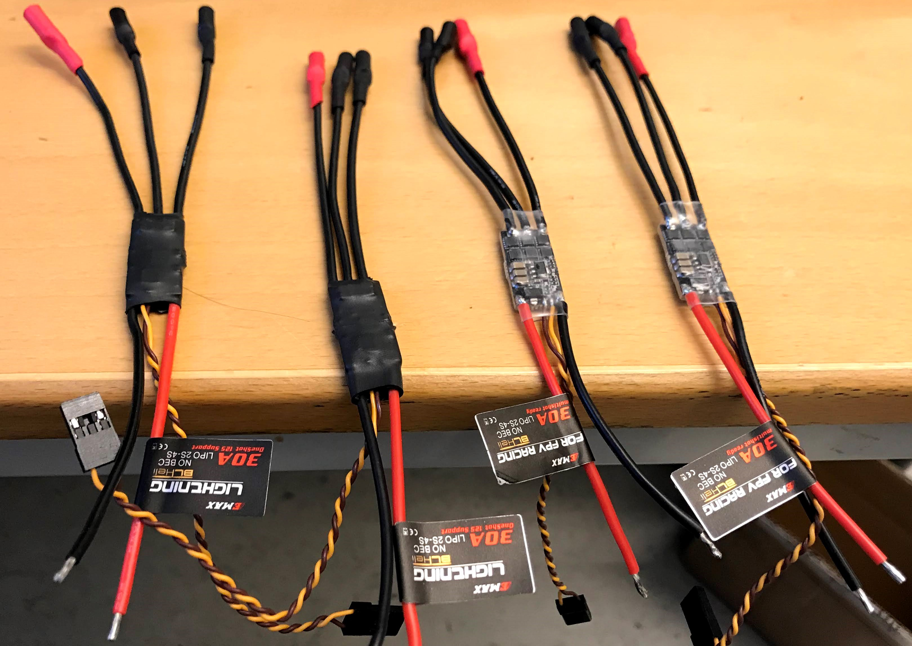
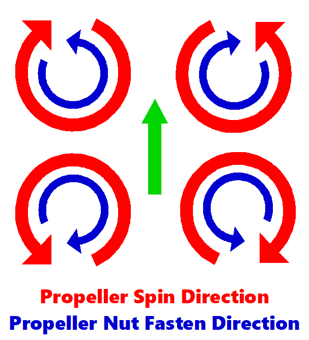
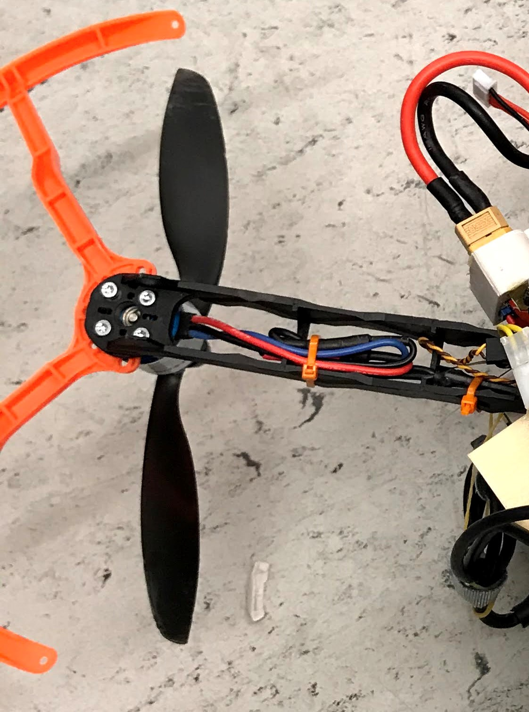

# Propulsion Assembly

## Required Parts

  * 4x 30A, 2S-4S ESC's
  * 4x SunnySky X2216 V3 - 1250kV - short shaft motors
  * 4x Propeller guards (8045 size)
  * 4x 8045 Propellers
    * 2x CW & 2x CCW
  * 1x 5mm (M5) prop adapters kit
    * 2x CW & 2x CCW
  * 16x M3 x 14mm screws
  * 12x 3.5 mm bullet connectors (female)
  * 8x small zip ties (e.g. 100mm x 2.5mm)

## Procedure

When installing the propulsion system it is important to keep in mind that the
motors will spin in different directions, clockwise (CW) or counter-clockwise (CCW),
based on the motor location.
This image, from the PX4 documentation, shows the motor id and the
propeller spin direction for a Quad X multi-rotor copter like ours.

<kbd>
  
</kbd>

### ESC

 1. The SunnySky motors we are using come equipped with 3.5 mm bullet connectors (male).
    You will need to solder the female bullet connectors onto the 3 loose wires
    coming out of the ESC and insulate them with some thermal shrink fit.

    <kbd>
      
    </kbd>

 2. Add thermal shrink fit over the ESC's for insulation / protection.
      1. Note that we used the clear thermal fit on the CW ESC's and the black on the
         CCW ESC's for easier identification, but they are identical electrically.

 3. Solder the loose ESC power-in cables to the open terminals on the underside of the
    Q380 drone frame bottom plate, where the arm connects to the bottom plate.
    1. Red -> Positive | Black -> Negative

    <kbd>
      
    </kbd>

 4. In the [Sensor Plate Assembly](sensor_plate.md) instructions, you will add an
    extension to the PWM connection cable, so you can leave this cable loose for now.
    Once that extension is prepared, the ESC's PWM cable plugs into the extension
    where the arm connects to the bottom plate.
    The connections will be made based on
    [Quadrotor x Airframe Reference](https://docs.px4.io/master/en/airframes/airframe_reference.html#quadrotor-x).

### Motor Mounting

 1. Install the CW & CCW propeller adapters (2 of each) onto the motors
    using the M2 screws that come in the kit.
    The supplied adapters with the SunnySky motors are all one direction,
    so you would experience self-loosening on two of the motors if you didn't
    use the purchased adapter kit.
    Select motor locations so the prop nuts will be self-tightening, based on:

    <kbd>
      
    </kbd>

 2. If using the purchased propeller guards (as recommended),
    the two outermost screws will need to go through the guard
    to hold it in place. Place it between the top of the
    arm and the bottom of the motor and line up the holes.
 3. Mount the motors with the the M3 x 14mm screws onto the drone
    arms with the wires running straight back along the arm,
    as seen above
    1. MAKE SURE THE SCREWS ARE NOT CONTACTING THE MOTOR WINDINGS!
       This would be catastrophic for the motors.

    <kbd>
      
      Motor mounting, seen from the underside
    </kbd>

 4. Connect the motor leads to the ESC's with the bullet connectors,
    as seen below.

    <kbd>
      
    </kbd>

 5. Use one small zip tie to secure the ESC against the inside of the Q380 arm and
    another to hold the wires together, also secured to the inside of the Q380 arm.

### Check Spin Direction

Check that the motors are spinning in the correct direction before adding the propellers,
as mentioned in [Motor/Servo Checks](https://docs.px4.io/v1.10/en/config/motors.html).

There are MANY ways to do so, but one method we found convenient
(once the drone is fully assembled / setup) is:

 1. MAKE SURE NO PROPELLERS ARE INSTALLED!
 2. Ensure all connections are made supplying power to the motors and Pixhawk
 3. Connect the PWM cables from the ESC's to the Pixhawk PWM-out ports
    per [Quadrotor x Airframe Reference](https://docs.px4.io/master/en/airframes/airframe_reference.html#quadrotor-x)
 4. Connect the battery so the Pixhawk boots up and pre-arm the drone with the arming button.
    1. The motors should beep, indicating they are powered up
 5. Use the radio controller to arm the drone with the arming gesture,
    which will cause the motors to spin at the lowest PWM value (duty cycle)
    1. This is a PX4 parameter called `PWM_MIN` that can be changed in
       QGroundControl, if the default value of 1000 is too low. See
      [PWM Outputs - Parameter Reference](https://docs.px4.io/v1.9.0/en/advanced_config/parameter_reference.html#pwm-outputs)
       1. Verify that the issue is that the `PWM_MIN` parameter is set too low before changing
          it by gently throttling up on the remote control as though you were flying.
       2. If this doesn't cause the motors to spin, there is another issue in your setup.
 6. Lightly touch the SLOWLY spinning motors with your finger to
    feel which direction they are spinning and verify it matches the design
    1. If they are visibly spinning quickly, do not touch the moving parts
 7. Disarm the drone and remove the connected power before making any necessary wiring changes

### Propellers

The propellers should not be added until:

 1. The motor spin direction has been verified
    1. Improper spin direction of one or more motors will cause an immediate crash
 2. You are fully ready to fly
    1. It can be dangerous to work on the drone and/or debug software
       with the propellers connected, as one may unexpectedly begin
       turning and cause damage / injury.

To attach the propellers:

 1. Match the CW & CCW propellers to the motors they will be attached to
    1. It is better to base this off of the leading edge rather than
       any propeller markings, as the markings can vary between propeller manufacturers
 2. Use the nut included with the prop adapter to secure the propeller
 3. It is not necessary to over-tighten these nuts, as they should be self-tightening during flight
    1. If you see them coming loose during flight, you may have swapped the CW & CCW adapters around
