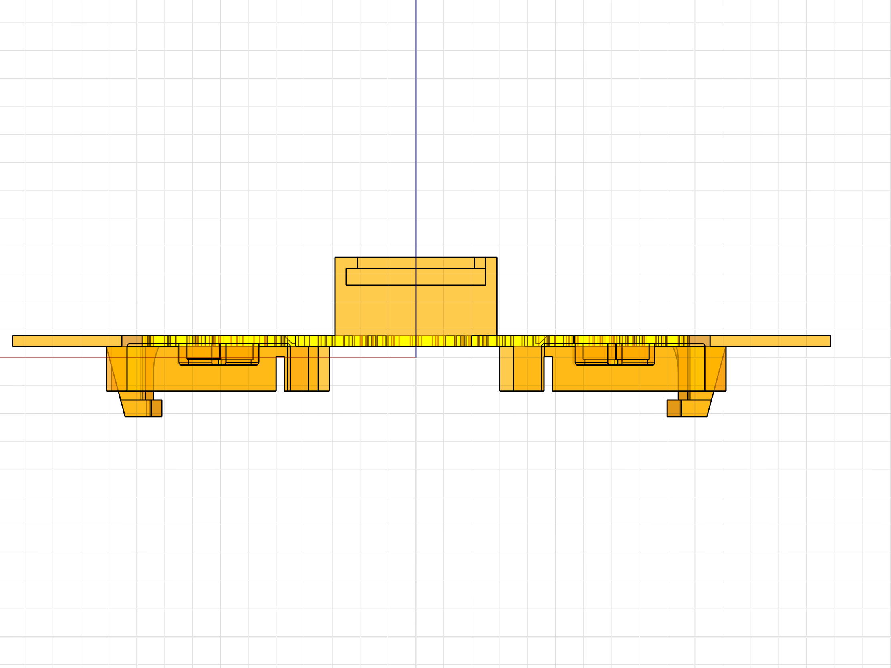
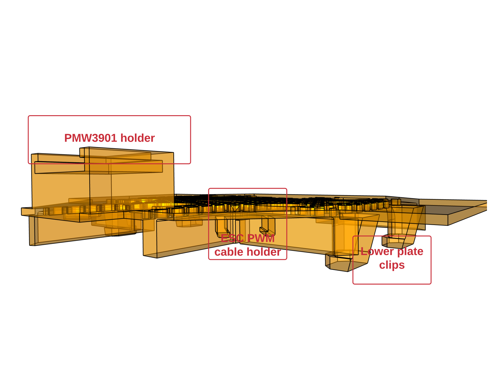
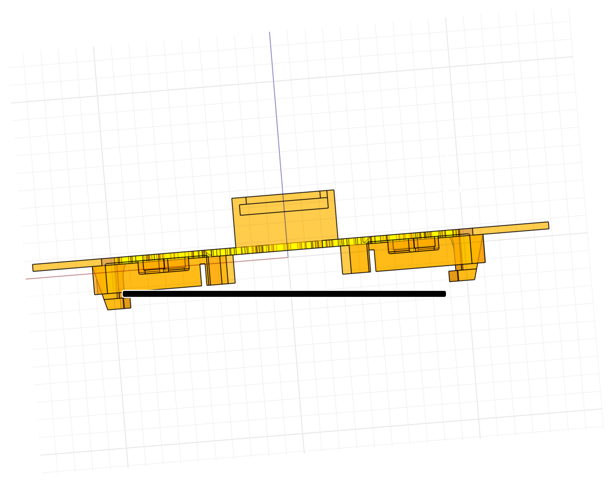
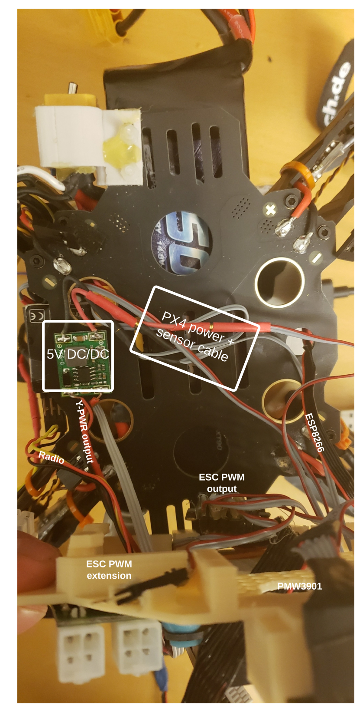
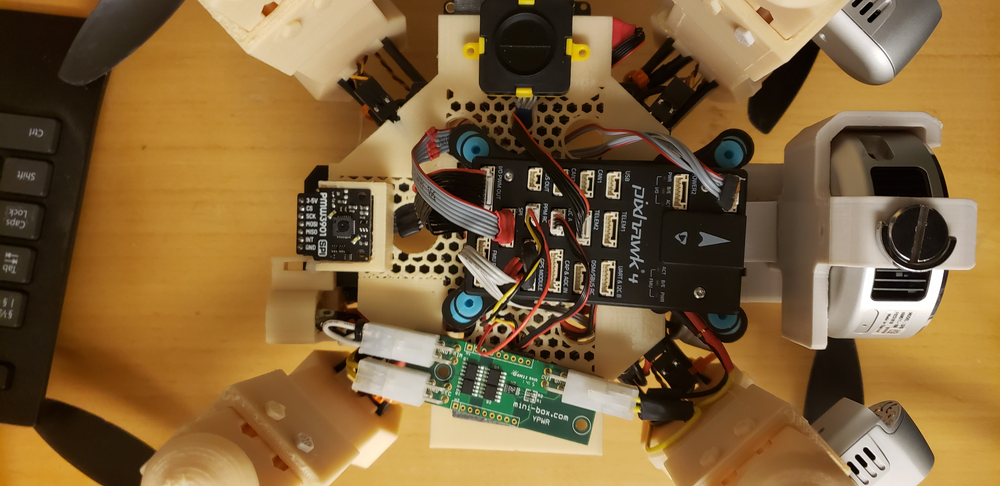

# Sensor Plate

The sensor plate is a 3D printed base to help expand the available space in the bottom plate of the drone to allocate the PX4, Teraranger Evo Mini,Y-PWR,and PMW3901 while allowing for a better cable distribution underneath. This particular setup allows for easy access to the controller and the sensors.

 > Top view

<kbd>
  
</kbd>

> Side view

<kbd>
  
</kbd>

> Bottom view

<kbd>
  
</kbd>

> PWM cable holder

<kbd>
  
</kbd>

The plate itself is easy to attach, it has 4 clips to the side (see the side and bottom view) that allow to snap the plate to the bottom of the frame. The best way to fit the plate without risk of breaking the clips is to start with one side. Fit the frame's bottom plate left or right side in between the 2 clips on that same side, once you feel that the plate is in position, push the other side. The following picture is a clearer example.

<kbd>
  
</kbd>

---

To install the components, please refer to the following image. First, the necessary cables are needed to be placed in the bottom plate of the frame.

<kbd>
  
</kbd>

You will notice a small spline near the ESC PWM extension holder, this is intended to allow the cable to run through.

<kbd>
  
</kbd>

Note that the ESC PWM cable extender has two colors, red and grey. The red cable indicates the signal to be connected to the ESC.

---

The following image shows the intended final mounting.

<kbd>
  
</kbd>

The PX4 is secured with a zip tie that runs under the 3D printed plate and the vibration damper, the little hexagons allow the zip tie to run easily. The PMW3901, Teraranger Evo Mini and the Y-PWR have a two side sticky pad to adhere to the plate. All the cables run in the gap between the bottom plate and the sensor plate.
