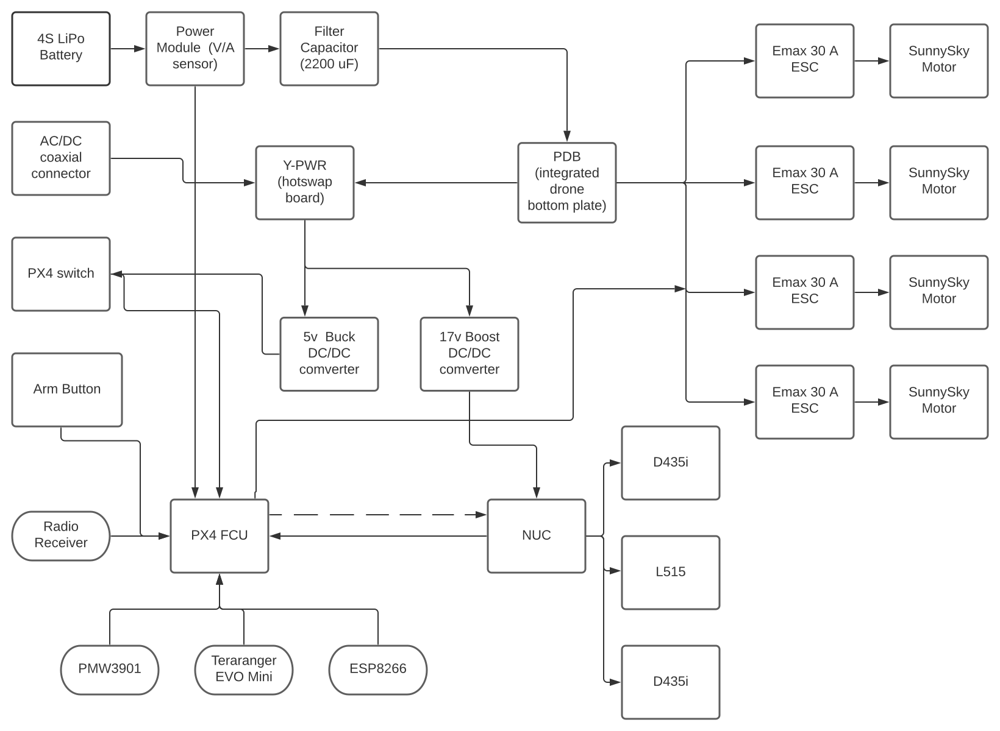

## Electrical design considerations.
---

As stated previously, the aim of the project was to improve previous versions of the research drones. The reported issues with the previous platforms are:

> Hexacopter:

+ Burnt motors, high pitch noise.

> Quadcopter:

+ NUC power disruption on takeoff or power surge.
+ No current sensor.
+ Two PDBs used.

Each motor would need to generate at least ~1.3 kg of force to keep the 2:1 ratio.
From the vast options of motors and propeller configurations, we employed [eCalc](https://www.ecalc.ch/xcoptercalc.php)1 to have a better guideline to select the adequate motor. We selected SunnySky X2216-7 1250 KV III for its ratings and specs.

<kbd>
  
</kbd>

1. eCalc was taken as a rough estimate/guideline of the final performance of the drone.

According to SunnySky [datasheet](https://sunnyskyusa.com/collections/x-v3-motors/products/sunnysky-x2216), the following combination meets the requirements:

<kbd>
  
</kbd>

## Electrical Diagram

Taking these considerations, the electrical diagram/design is the following:

<kbd>
  
</kbd>

1. The Q380 bottom plate was used as the PDB, this simplifies the cabling and saves space.
2. We decided to keep the [Y-PWR](https://www.mini-box.com/Y-PWR-Hot-Swap-Load-Sharing-Controller) hot-swap load sharing controller, as it acts as an ideal OR to alternate between battery power and wall power.
3. The 2200uF capacitor was selected according to recommended values for drones, to filter ripples, spikes and noise from the LiPo battery (produced by variations in the voltage, current, and frequency demanded by the circuit), the aim is to provide a more stable output. This capacitor can also provide voltage for a brief instance if there is a sharp voltage drop or power surge, such as drone take off.
4. Given the fact that the payload of the drone was expected to be at most 2.5 kg, the ideal motor needed to be a low KV (Rpm per volt) motor. The advantage of a low KV motor is that it produces more torque (hence a bigger propeller can be used), thus generates more static thrust for lifting at a lower current draw compared to higher KV motors. The downside is that the motors are not as fast as higher KV mototrs, however this is desired for the end applicaiton.
5. According to the SunnySky [datasheet](https://sunnyskyusa.com/collections/x-v3-motors/products/sunnysky-x2216) for the 1250kV motors, the motors will draw a maximum of 36.2 A each if the thrust generated is 1.37 kg. However, as the thrust required to lift the drone (hovering) will never reach that value, the average draw will at most be 20 Amps. Hence, 30 A ESC were selected, these have proven to work properly with our setup.
  <kbd>
    
  </kbd>
6. To properly calibrate the ESC, so that the controller knows the maximum and minimum PWM values that can be provided, we employed a function generator. ESC calibration may vary between different brands, however, for the selected ESC, the following method works:
    + Generate a 5V pulse train with a frequency of 50Hz.
    + Set the Duty Cycle to 5%.
    + Connect the function generator output to the ESC PWM wires.
    + Connect the battery to the drone.
    + Set the function generator output to ON. You should hear a tone with 2 or 3 beeps.
    + After the tones, increase the Duty Cycle to 10%, a number of beeps will be heard, followed by an intermittent tone, which will indicate that the calibration process is done.
    + Alternatively, you can use [QgroundControl](https://docs.px4.io/v1.10/en/advanced_config/esc_calibration.html)

7. To power the NUC and the PX4 controller, DC/DC converters were selected. Despite the fact that the NUC could be operated directly from the LiPo battery as the input voltage ranges from 12V to 19V, it is not desirable. Voltage dips and transients can damage or affect the NUC operation. E.g. at take off, a voltage sag may result from the power surge demanded by motors and turn off the NUC (voltage lower than 12 V). For this reason, a 150W DC/DC Boost converter was selected to deliver a maximum constant 17 V to the NUC, despite changes in the input voltage.
For the PX4, a Buck converter was used to deliver continuous 5 V to the controller. The same selection criteria applies for the controller.

8. The power module that is connected right after the battery is mainly used to provide the current and voltage sensor readings to the PX4, however, the actual voltage to power the PX4, comes from the 5V Buck converter after the Y-PWR board. This achieves the following:
  + The PX4 switch is used to turn ON/OFF the controller and the V/A sensor reading.
  + If the PX4 gets powered by the NUC (USB), the switch enables/disables the V/A reading (as a second safety measure, the drone will not arm).
