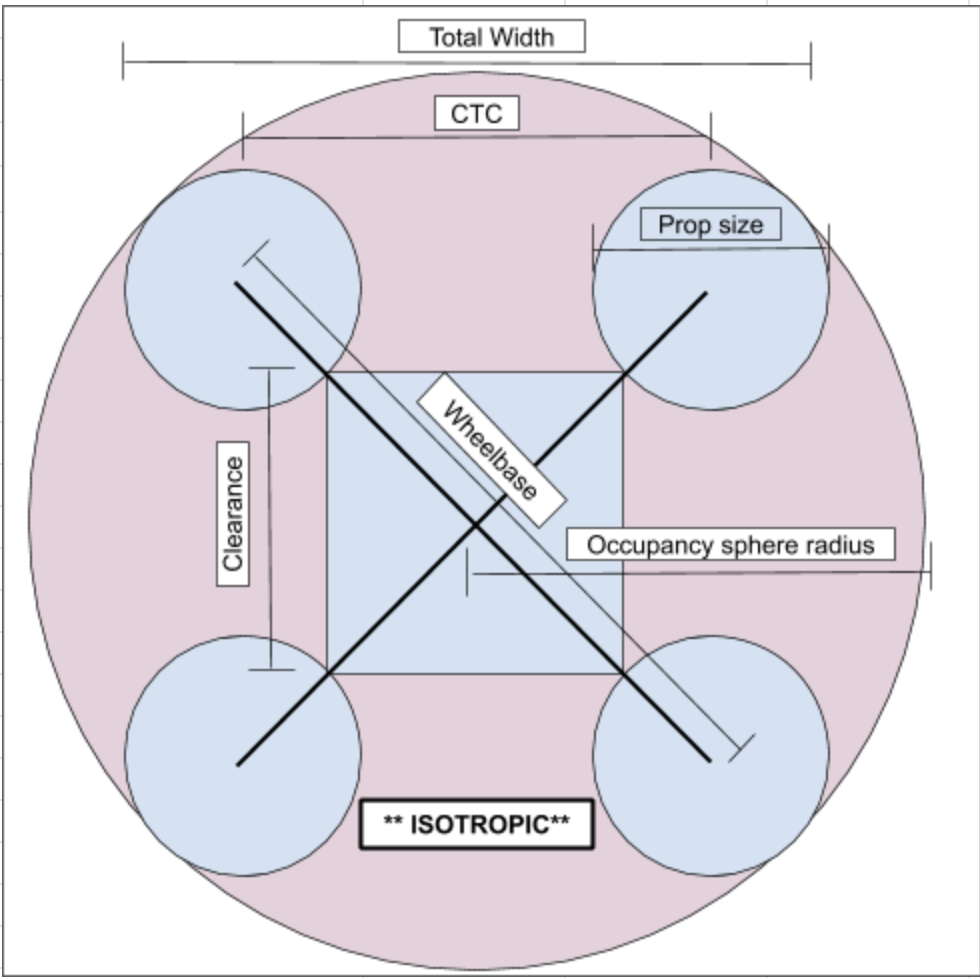

## Mechanical design considerations.
---

The main objective of this project was to improve the existing drone platforms.

  + *Previous working quadcopter*
<kbd>
  
</kbd>
  + *Previous working hexacopter*
  <kbd>
    
  </kbd>  

  | Exisitng Drone Specs - Quadcopter | |
  | --------------------------------- |     |
  | Wheelbase (mm)                    | 260 |
  | Prop size (mm)                    | 153 |
  | Max width (mm)                    | 370 |
  | Occupancy sphere radius           | 207 |
  | Empty Mass (g)                    | 760 |
  | Full Mass (TX2, 4000mAh LiPo)     | 1328 |
  | Number Propellers                 | 4 |
  | Minimum Trust Rastio ( \_ : 1 )   | 2 |
  | Minimum Thrust per motor (g)      | 664 |

  | Exisitng Drone Specs - Hexacopter         | |
  | ----------------------------------------- | |
  | Wheelbase (mm)                            | 290 |
  | Prop size (mm) \*                         | 127 |
  | Max width (mm)                            | 420 |
  | Occupancy sphere radius                   | 209 |
  | Empty Mass (g)                            | 1376 |
  | Full Mass (8000mAh LiPo)                  | 2026 |
  | Number Propellers                         | 6 |
  | Minimum Trust Rastio ( \_ : 1 )           | 2 |
  | Minimum Thrust per motor (g)              | 676 |
  |                                           |  |
  | \* Hexacopter uses three blade propellers |

 In order to design the new drone, we first required to take into consideration the space limitations on which the previous drones operated and their current specs. In this case, as an indoor drone, it was desirable to be able to pass through doors (800 mm wide) with enough clearance. Given this constrain, we then required to choose the type of frame, motors and propellers that could meet the following requirements:

  + Longer flight time.
  + Better motor/propeller pairing.
  + Heavier payload (3 Intel RealSense cameras & a NUC).
  + Better weight distribution (keep center of mass close to the center of the drone).
  + Stable flight.

Starting with the frame, we decided upon a X body, as it is symmetric (pitch & roll), strong, compact and simple. Its natural symmetry  is better for balancing flying forces. Considering as well the biggest element the drone carries (Intel NUC), the ideal dimensions were reduced to the following diagram.

<kbd>
  
</kbd>

| Element                  | Size(mm) ||
| ------------------------ | -------- ||
| Wheelbase                | 380      ||
| Propeller                | 204      ||
| Drone Occupancy Radius   | 292      ||
| Drone Occupancy Diameter | 584      ||
| Clearance                | 124      ||

To determine the type of motors and justify the use of 8" propellers, we took an estimate of the total mass that the drone had to lift, taking the following considerations:

| Expected Mass Calculations - Fully Loaded |||
| ----------------------------------------- |||
| Component                                 | Component Mass (g) | Count |
| Light Frame                               | 200 | 0 |
| Heavy frame                               | 710 | 1 |
| NUC                                       | 226 | 1 |
| TX2                                       | 174 | 0 |
| LiPo Battery (4000 mAh)                   | 392 | 0 |
| LiPo Battery (8500 mAh)                   | 672 | 1 |
| RealSense D435i                           | 72 | 2 |
| RealSense D455\*\*                        | 120 | 0 |
| RealSense L515\*\*\*                      | 100 | 1 |
| SunnySky X2216-7 1250 KV III              | 69 | 4 |
| Larger Motor (\_ what model? \_)          | 82 | 0 |
| Low Level Hardware - Small                | 380 | 0 |
| Low Level Hardware - Large                | 445 | 1 |
| Total                                     | 2573 | N/A |

Ideally we want to have a hovering lift force equal to the weight of the drone, that is a thrust ratio of 2:1. Hence, the maximum thrust we need to generate is 5146 g.

| Thrust Calculations          ||
| ---------------------------- ||
| Expected mass (g)            | 2573 |
| Thrust ratio ( \_ : 1 )      | 2 |
| Required Thrust (g)          | 5146 |
| Motor Count                  | 4 |
| Minimum thrust per motor (g) | 1287 |

Each motor would need to generate at least ~1.3 kg of force to keep the 2:1 ratio.
From the vast options of motors and propeller configurations, we employed [eCalc](https://www.ecalc.ch/xcoptercalc.php)1 to have a better guideline to select the adequate motor. We selected SunnySky X2216-7 1250 KV III for its ratings and specs.

<kbd>
  
</kbd>  

1. eCalc was taken as a rough estimate/guideline of the final performance of the drone.

According to SunnySky [datasheet](https://sunnyskyusa.com/collections/x-v3-motors/products/sunnysky-x2216), the following combination meets the requirements:

<kbd>
  
</kbd>  
