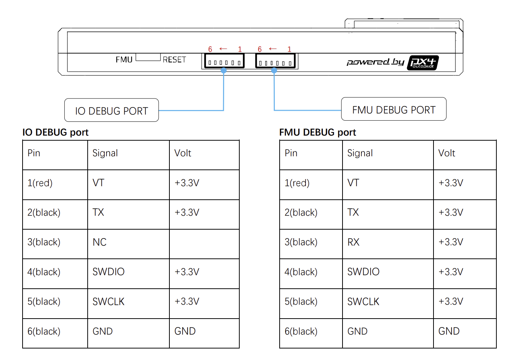
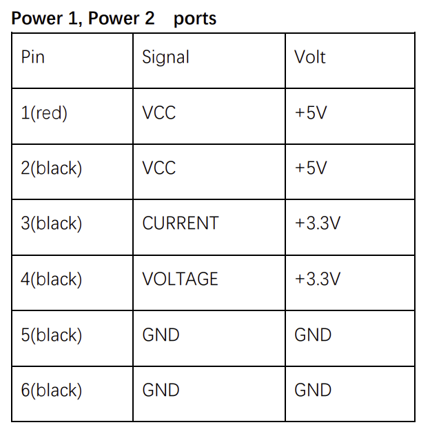

# Cabling Summary

<kbd>
  
</kbd>

The PX4 FMU v5 requires some custom cables to interact with the sensors. Here you will find the necessary information to replicate such cables.

---
### PMW3901 cable
The PX4 has 1 SPI port with the following pinout.Pixhawk SPI connector is JST-GH 7 pins.

<kbd>
  
</kbd>

<kbd>
  
</kbd>

---
### Teraranger EVO mini cable

From the official documentation, you require to wire the Teraranger like [this](https://www.terabee.com/connection-to-pixhawk-autopilots-teraranger-evo/).

The PX4 FMU v5 has two I2C ports, you are interested in the port A. Pixhawk I2C connector is JST-GH 4 pins.

<kbd>
  
</kbd>

---
### ESP8266 cable
The PX4 FMU v5 has 2 telemetry ports. Telemetry 2 is the port to connect the ESP8266. The connector is a  JST-GH 6 pins.

<kbd>
  
</kbd>

<kbd>
  
</kbd>

---
### Arm button cable
The PX4 FMU v5 has 1 GPS port, this port has the pins needed for the arm button. The connector is a JST-GH 10 pins.

<kbd>
  
</kbd>

<kbd>
  
</kbd>

---
### Debug IO/FMU cable
The PX4 FMU v5 has 2 debug ports, one for I/O and another for the FMU. The connector is a male JST SM06B 6 pins. The one we use is the FMU debug port.

<kbd>
  
</kbd>

<kbd>
  
</kbd>

---
### PX4 power + sensor connector
The PX4 FMU v5 has 2 power ports, the one we are interested in is POWER 1 port. The connector is a JST-GH 6 pins. This cable s different from the previous as it connecets different parts of the system. One end requires a DF13 male connector to interact with the Power Module current and voltage sensor readings.

<kbd>
  
</kbd>

<kbd>
  
</kbd>

