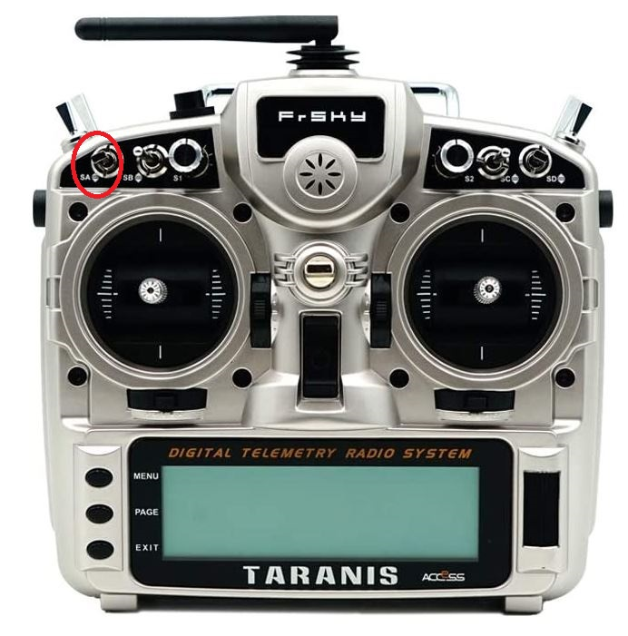

# Flight Modes

## Flight Modes Setup

We recommend for you to start off by flying with two flight modes:

 1. Manual Mode
 2. Position Hold Mode

until you are prepared to fly with Autonomous Flight Mode
(as a 3rd flight mode).

The [PX4 Flight Modes Overview](https://docs.px4.io/master/en/getting_started/flight_modes.html),
and the referenced links found on that page
(e.g. [Flight Mode Configuration](https://docs.px4.io/master/en/config/flight_mode.html)),
provide ample detail on the usage and setup of these modes in QGroundControl and on
the radio remote control, specifcally the FrSky Taranis X9D.

We found the `SA` switch on the FrSky Taranis X9D radio remote control
to be a convenient switch to use for switching between flight modes as it
is well located and it should allow for switching between three
Flight Mode settings.

<kbd>
  
</kbd>

