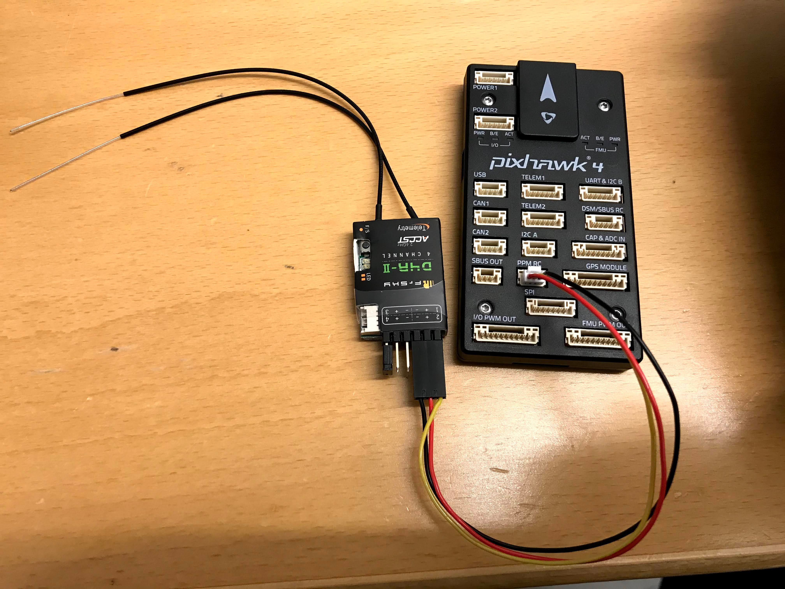

# Setting up the FrSky D4R-II Radio Receiver

We use the [FrSky D4R-II Radio Receiver](https://www.frsky-rc.com/product/d4r-ii/)
and bind it to the [FrSky Taranis X9D Plus](https://www.frsky-rc.com/product/taranis-x9d-plus-2/)
digital Telemetry Radio system (our transmitter).

<kbd>
  
</kbd>

## Instructions

### Instructional Video

The instructions for setting up the receiver and binding it to the transmitter
are based on the instructional video [How To Bind FrSky D4R-II Receiver](https://www.youtube.com/watch?v=ngzWn0WlxLE).
Note that we will be using PPM mode.

### Connection

<kbd>
  
</kbd>

 1. Connect signal pins for channels 3 and 4 using jumper to put receiver in **PPM** mode.
 2. Connect the 3 wire servo cable to receiver channel 1 and plug this into the **PPM RC** port on the Pixhawk 4.
 3. Check the status lights on the D4R-II to determine if the receiver is powered on and bound.
    1. A blinking red light indicates it is receiving power, but is not bound. Power on the transmitter and, if still red, see binding instructions below.
    2. A solid green light indicates power and proper binding.
    3. Solid green and red lights indicates firmware incompatibilities between receiver and transmitter.

<kbd>
  
</kbd>

### Binding to Transmitter

 1. Power on Taranis X9D Plus.
 2. [Menu] -> Model -> [PAGE]
    1. D8 Mode and CH1-8
 3. Select receiver bind option and press [ENT].
    1. The Taranis should start chirping.
 4. Hold down failsafe (F/S) button on D4R-II while applying power by connecting the Pixhawk 4 to USB.
 5. Wait until you see a solid green light and a blinking red light ton the D4R-II to release the F/S button.
 6. Power off Pixhawk 4 by unplugging from USB.
 7. Exit Bind mode on the transmitter and go to the home screen.
 8. Power on Pixhawk again and confirm there is only a solid green light on the D4R-II.

### Calibrate the receiver / transmitter

In QGroundControl, just follow the instructions under the Radio tab.